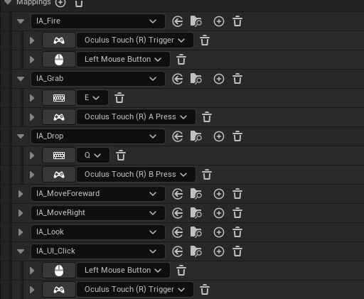

Realizado por: José Ángel Sala García

### Cosas a tener en cuenta de mi trabajo:
- Todo el desarrollo del proyecto ha sido realizado por mí desde cero, a excepción de los assets utilizados (abajo está la sección de licencias).  

- En el vídeo se muestra la gestión de los menús; sin embargo, debido a dificultades técnicas con la detección en VR, no ha sido posible corregir completamente la interacción en los menús dentro de la versión VR.

- A pesar de ello, la experiencia ofrece un flujo completo: el jugador decide cuándo comenzar la partida, dispone de dos minutos para jugar, y al finalizar puede reiniciar y volver a intentarlo tantas veces como desee.

A continuación se explica cómo jugar.

## Documentación del proyecto

### Descripción de la experiencia

- El objetivo es **disparar a los patitos y evitar los limones**.  
Cada vez que aciertas al pato, todos los objetos desaparecen y se reorganizan aleatoriamente, comenzando un nuevo reto.

- Dispones de **120 segundos** para conseguir la máxima puntuación posible, **disparando a tantos patitos como puedas**.  
    Si disparas a un limón, perderás 1 punto.
    Si disparas a un patito obtendrás un punto.

- La experiencia comienza al pulsar el botón de **Play** en el menú principal.  
  **Nota:** Por limitaciones técnicas en la versión APK, actualmente el juego empieza al disparar al reloj.  
  Desde ese momento, tendrás **120 segundos** para conseguir tu mejor puntuación.  
  Al terminar, puedes volver a disparar al reloj para reiniciar la partida.

### Controles

- **Controles VR:**  
  Los controles son todos validos menos los del Menú, que solo funcionan para la versión PC
- **Menús UI:**  
  Debido a las limitaciones del simulador y la implementación en la APK, los menús UI no son totalmente funcionales en VR, pero el resto de controles sí responden correctamente.

---

- **Modelos 3D:**
  - **Pato:** Obtenido desde [Fab](https://www.fab.com/es-es/listings/3b92228d-7d21-483e-8456-4a2db71c86ae) (Unreal Engine Marketplace). La textura ha sido modificada respecto al original.
  - **Entorno:** Obtenido desde [Fab](https://www.fab.com/es-es/listings/52529a12-e88e-41a0-8834-b87306f20c24) (Unreal Engine Marketplace).

  > *Los assets descargados desde Fab se utilizan bajo la licencia de Epic Games para proyectos Unreal Engine. Más información: [Epic Content License Agreement](https://www.unrealengine.com/en-US/eula/publishing).*

- **Sonidos:**
  - **Disparo:** saturdaysoundguy, [Sound link](https://freesound.org/people/saturdaysoundguy/sounds/394187/)
  - **Pato:** LamaMakesMusic, [Sound link](https://freesound.org/people/LamaMakesMusic/sounds/403507/) 
  - **Error:** Raclure, [Sound link](https://freesound.org/people/Raclure/sounds/483598/) 

---

### Entrevista

- "¿Qué dificultades has encontrado durante el desarrollo? ¿Cómo las has resuelto?"
    
    - Primeros pasos con blueprintes y  comunicación:
        - Me costó mucho entender y aprender funciones de blueprints, pero sobre todo lo que más me costó fue el paso de información entre blueprints, conexiones...
        - Lo resolví con el tiempo y paciencia, poco a poco fuí aprendiendo.

    - Gestión de UI en VR:
        - Sin duda alguna me costó mucho mas de lo esperado, sobre todo por el como gestionaba los timers y los controladores anteriormente.
        - Hice  los InputAction Enhanced y entendí mejor como funcionaba.

    - Assets:
        - Me dieron muchos problemas del estilo Never Cook y la libreria que cogí era muy dependiente, al final me las tuve que buscar para cambiar texturas o implementar nuevas en bases a las ya creadas para que se parecieran un poco a las que había antes y había tenido que quitar.

    - Spawner:
        - Algo que también me llevó tiempo de hacer fue el spawner de patitos y limones randomizado.
        - Me costó numerosos intentos y pasé por varios prototipos pero al final estoy contento con el resultado.

- "Si tuvieras más tiempo, qué aspectos de tu experiencia te gustaría mejorar y cómo":
    -  Me gustaría implementar un sistema por rondas y una leaderbox de estas rondas. La base ya la tiempo, el scoredisplay y la gestión de única ronda, sería escalarlo más.
